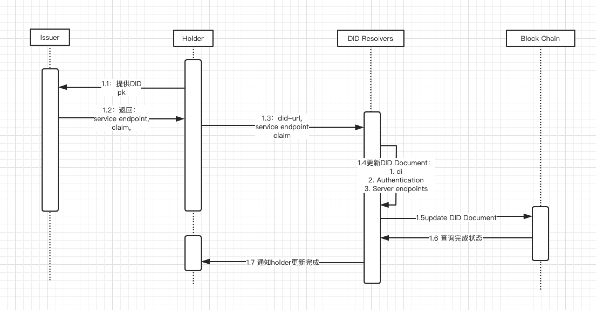
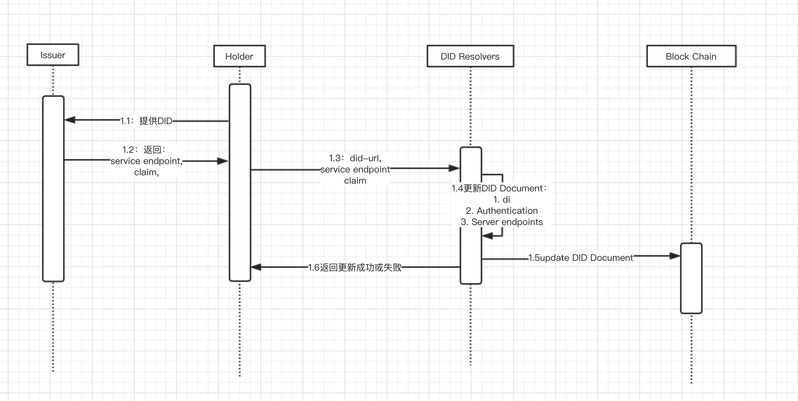
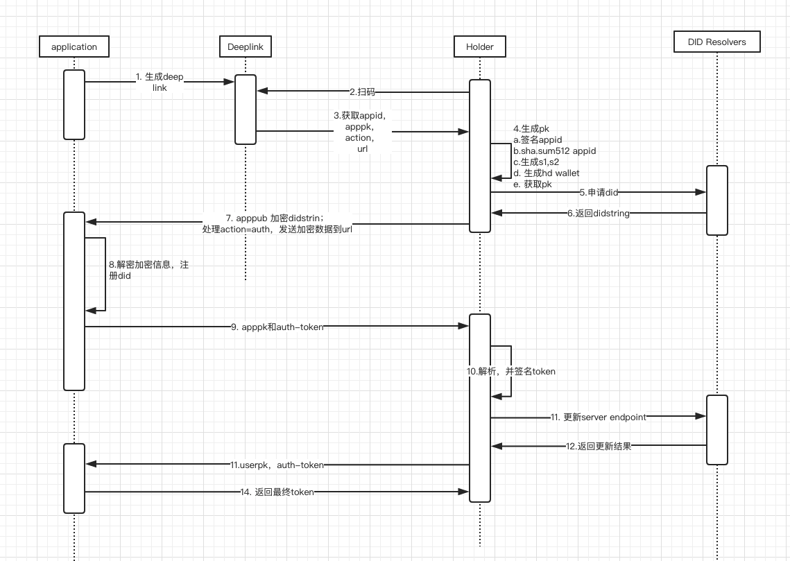
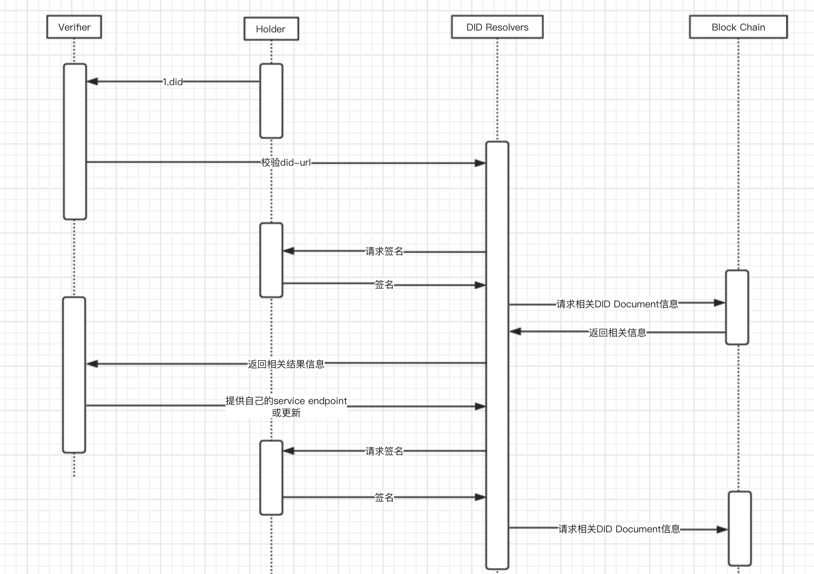

# DID 系统说明
## 1. 角色
### 1.1 Holder，Users
DID 持有者，用于存储用户的的did，其实体可以是钱包，也可以是其他系统的一个账户。其功能包含申请did，存储DID，签名DID。同事用于用户基础信息管理。类似于url。

### 1.2 DID Resolvers 
DID 核心模块与链直接沟通，对外暴露为API或者SDK，提供DID创建，DID加密/解密，DID Document的创建，发布，读取，更新，停用。类似于DNS的作用。

### 1.3 Claims Issuer
::: tip
当 Claims Issuer 对外提供服务时，其兼顾Service Providers的角色
:::
证书发行方，为 Holder提供各种各样的证书以及对应的服务。可以是政府机构，公司，组织等。

### 1.4 Verifier
::: tip
当 Verifier 对外提供服务时，其兼顾Service Providers的角色
:::
证书验证方和服务提供方，主要用于验证holder的相关信息，同事提供服务。可以是网站，app，平台等。

### 1.5 Service Providers
服务提供方，提供相关服务

## 2. 系统结构

## 3. 系统时序
### 3.1 申请DID 和DID Document
> Holder通过其主体向  DID Resolvers 申请DID和对应的DID Document

### 3.2 issuer
> Holder向issuer注册其did，并获取对应的service endpoint 和 Claims。并提交更新相应的DID Document。

:::tip 示例:通过did进行某个业务相互通讯过程。

:::

### 3.3 Verifier
> 校验其所需的信息，并提供相应的服务

