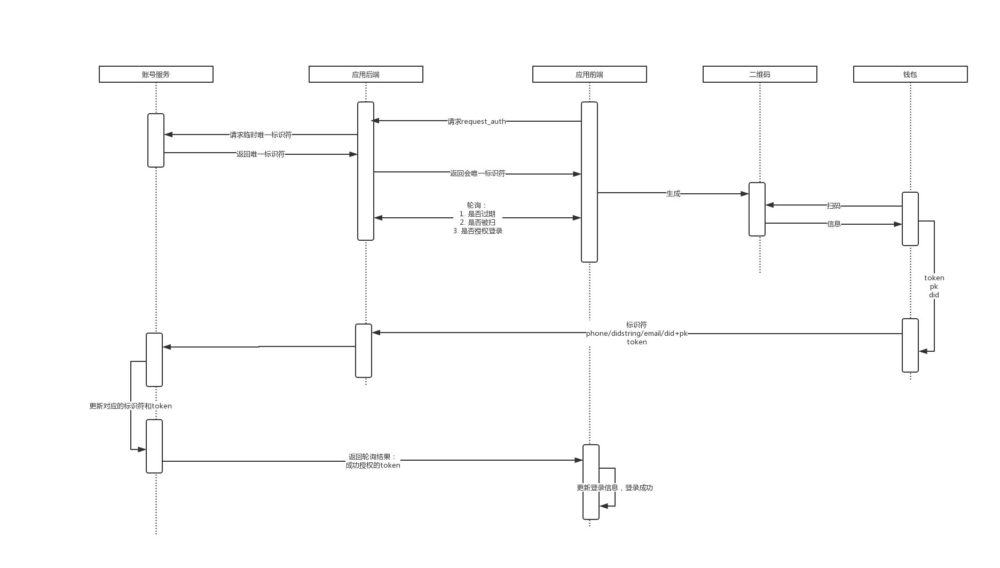

# DID 与中台其他服务的结合

## 1. DID 与钱包服务结合。
> 由于DID的特性无法以实体的形式提供给用户，在这里依靠钱包这个实体来使用DID这个服务

### 1. DID methods注册
在中台引入did服务后需要先注册当前应用的did methods

### 2. 钱包和DID结合
钱包在生成bip44账户地址时调用did方法生成对应的did。

## 2. DID 与 账号服务的结合 - 直接注册账号。
> 此处有一个问题：中台的钱包服务已基于中台账号服务(手机号+密码登录)做了注册和登录。 是否可以增加新的方式直接使用DID string + 公钥进行与中台账号服务结合。

### 1. 基于DID服务的[workfow](/didserver/DIDDesign.html#_7-workflow)流程。
> 账号服务需要以下升级

1. 账号服务先到公私钥注册中心获取应用的公私钥。

2. DID 和 账号服务 进行公钥交换

3. 应用方(例如钱包)使用DIDstring + pk在账户服务进行注册

4. 账号服务鉴权 DID，成功后 生成 DIDstring pk 和account的关系数据

### 2. DID string 登录
1. 应用方使用私钥签名didstring。
2. 应用方调用serverendpint的login进行登录：使用应用的公钥进行二次加密。
3. 账号服务使用私钥进行解密。然后使用didstring对应的公钥进行验签。正确则登录成功。是正确的则登录失败。

## 3. DID与账号服务结合 - 绑定did
> 由于did实体为钱包，而钱包的行为操作大多依赖于扫码这一行为，所以在did和中台账户上需要升级账号服务：账号服务增加扫码登录。

### 1. 扫码登录

1. 中台应用向账号服务申请当前clint的唯一标识
2. 中台应用前端基于唯一标识生成二维码。并轮询标识的状态：
    1. 唯一标识的过期状态
    2. 唯一标识是否被扫码
    3. 唯一标识是否扫码授权登录成功
3. app端进行登录
4. app端进行扫码
5. 账号服务更新扫码状态
6. app授权登录
    将唯一标识和当前app中登录的token提交给授权url。
7. 账号服务鉴权是否授权成功。成功则将当前唯一标识与token绑定。
8. 应用前端轮询3后更新登录状态。
9. 扫码登录流程结束。

### 2. 基于扫码登录的did绑定
1. 将钱包当前账户所关联的did一并返回给账号服务
2. 账号服务绑定当前账户对应的did

## 3. DID与其他Server endpoint的auth过程请看workflow
本质其享有server endpoint的过程都需要走workflow这个过程。然后才能正确的取到对应的数据。