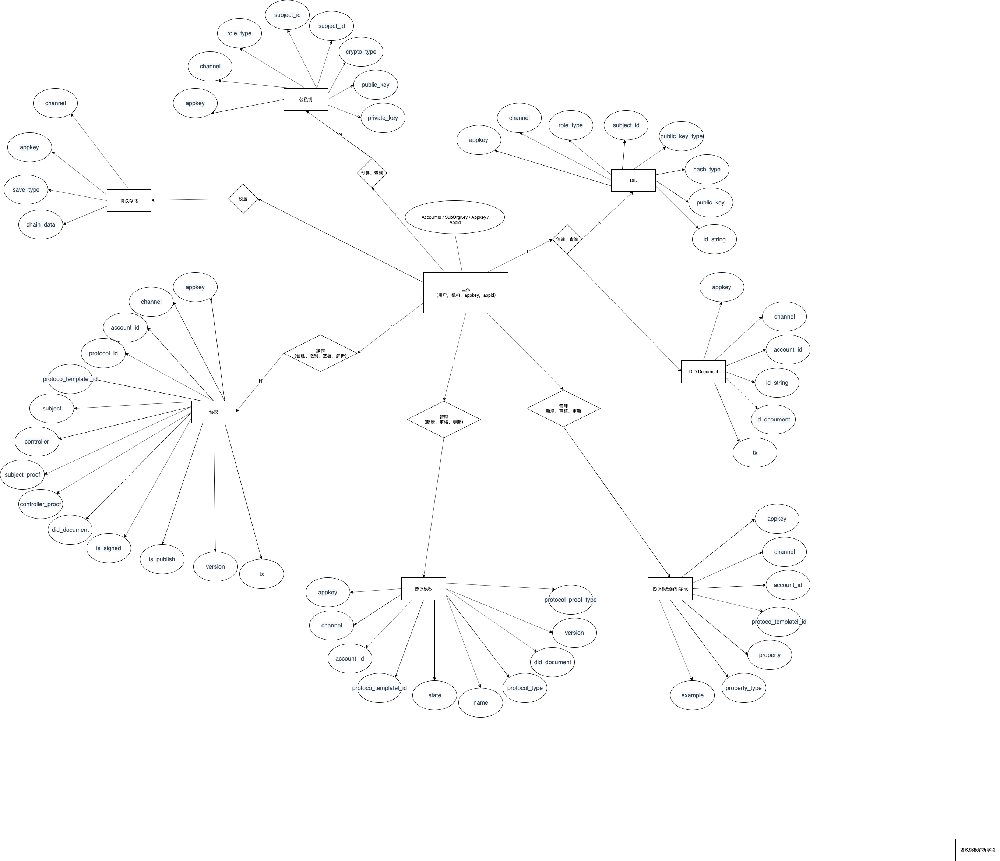

# 中台协议

## E-R 图定义



## 数据表

### 公私钥

| 名字        | 类型         | 排序规则        | 属性     | 空  | 默认 | 注释 | 额外           |
| ----------- | ------------ | --------------- | -------- | --- | ---- | ---- | -------------- |
| id          | int(10)      |                 | UNSIGNED | 否  | 无   |      | AUTO_INCREMENT |
| appkey      | varchar(50)  | utf8_general_ci |          | 是  | NULL |      |
| channel     | varchar(50)  | utf8_general_ci |          | 是  | NULL |      |
| role_type   | varchar(50)  | utf8_general_ci |          | 是  | NULL |      |
| subject_id  | varchar(255) | utf8_general_ci |          | 是  | NULL |      |
| crypto_type | varchar(255) | utf8_general_ci |          | 是  | NULL |      |
| public_key  | varchar(255) | utf8_general_ci |          | 是  | NULL |      |
| private_key | varchar(255) | utf8_general_ci |          | 是  | NULL |      |
| created_at  | timestamp    |                 |          | 是  | NULL |      |
| updated_at  | timestamp    |                 |          | 是  | NULL |      |
| deleted_at  | timestamp    |                 |          | 是  | NULL |      |

### did 数据表

| 名字            | 类型         | 排序规则        | 属性     | 空  | 默认 | 注释 | 额外           |
| --------------- | ------------ | --------------- | -------- | --- | ---- | ---- | -------------- |
| id              | int(10)      |                 | UNSIGNED | 否  | 无   |      | AUTO_INCREMENT |
| appkey          | varchar(255) | utf8_general_ci |          | 是  | NULL |      |
| channel         | varchar(255) | utf8_general_ci |          | 是  | NULL |      |
| subject_id      | varchar(255) | utf8_general_ci |          | 是  | NULL |      |
| id_string       | varchar(255) | utf8_general_ci |          | 是  | NULL |      |
| public_key_type | varchar(255) | utf8_general_ci |          | 是  | NULL |      |
| public_key      | varchar(255) | utf8_general_ci |          | 是  | NULL |      |
| role_type       | bigint(20)   |                 |          | 是  | NULL |      |
| key_type        | bigint(20)   |                 |          | 是  | NULL |      |
| hash_type       | bigint(20)   |                 |          | 是  | NULL |      |
| created_at      | timestamp    |                 |          | 是  | NULL |      |
| updated_at      | timestamp    |                 |          | 是  | NULL |      |
| deleted_at      | timestamp    |                 |          | 是  | NULL |      |

### 协议模板表

| 名字                 | 类型         | 排序规则        | 属性 | 空  | 默认 | 注释 | 额外           |
| -------------------- | ------------ | --------------- | ---- | --- | ---- | ---- | -------------- |
| id                   | int(10)      |                 |      | 否  | 无   |      | AUTO_INCREMENT |
| appkey               | varchar(50)  | utf8_general_ci |      | 是  | NULL |      |
| channel              | varchar(50)  | utf8_general_ci |      | 是  | NULL |      |
| account_id           | varchar(255) | utf8_general_ci |      | 是  | NULL |      |
| protocol_template_id | varchar(255) | utf8_general_ci |      | 是  | NULL |      |
| state                | varchar(255) | utf8_general_ci |      | 是  | NULL |      |
| name                 | varchar(255) | utf8_general_ci |      | 是  | NULL |      |
| protocol_type        | varchar(255) | utf8_general_ci |      | 是  | NULL |      |
| did_document         | text         | utf8_general_ci |      | 是  | NULL |      |
| protocol_proof_type  | varchar(255) | utf8_general_ci |      | 是  | NULL |      |
| version              | varchar(255) | utf8_general_ci |      | 是  | NULL |      |
| created_at           | timestamp    |                 |      | 是  | NULL |      |
| updated_at           | timestamp    |                 |      | 是  | NULL |      |
| deleted_at           | timestamp    |                 |      | 是  | NULL |      |

### 协议 JSON 字段对应关系表

| 名字                 | 类型         | 排序规则        | 属性 | 空  | 默认 | 注释 | 额外           |
| -------------------- | ------------ | --------------- | ---- | --- | ---- | ---- | -------------- |
| id                   | int(10)      |                 |      | 否  | 无   |      | AUTO_INCREMENT |
| appkey               | varchar(50)  | utf8_general_ci |      | 是  | NULL |      |
| channel              | varchar(50)  | utf8_general_ci |      | 是  | NULL |      |
| account_id           | varchar(255) | utf8_general_ci |      | 是  | NULL |      |
| protocol_template_id | varchar(255) | utf8_general_ci |      | 是  | NULL |      |
| property             | varchar(255) | utf8_general_ci |      | 是  | NULL |      |
| property_type        | varchar(255) | utf8_general_ci |      | 是  | NULL |      |
| example              | varchar(255) | utf8_general_ci |      | 是  | NULL |      |
| created_at           | timestamp    |                 |      | 是  | NULL |      |
| updated_at           | timestamp    |                 |      | 是  | NULL |      |
| deleted_at           | timestamp    |                 |      | 是  | NULL |      |

### 协议实例化数据表

| 类型                 | 排序规则     | 属性            | 空       | 默认 | 注释 | 额外 | 操作           |
| -------------------- | ------------ | --------------- | -------- | ---- | ---- | ---- | -------------- |
| id                   | int(10)      |                 | UNSIGNED | 否   | 无   |      | AUTO_INCREMENT |
| appkey               | varchar(50)  | utf8_general_ci |          | 是   | NULL |      |
| channel              | varchar(50)  | utf8_general_ci |          | 是   | NULL |      |
| account_id           | varchar(255) | utf8_general_ci |          | 是   | NULL |      |
| protocol_id          | varchar(255) | utf8_general_ci |          | 是   | NULL |      |
| protoco_templatel_id | varchar(255) | utf8_general_ci |          | 是   | NULL |      |
| subject              | varchar(255) | utf8_general_ci |          | 是   | NULL |      |
| controller           | varchar(255) | utf8_general_ci |          | 是   | NULL |      |
| subject_proof        | text         | utf8_general_ci |          | 是   | NULL |      |
| controller_proof     | text         | utf8_general_ci |          | 是   | NULL |      |
| did_document         | text         | utf8_general_ci |          | 是   | NULL |      |
| is_signed            | varchar(255) | utf8_general_ci |          | 是   | NULL |      |
| is_publish           | varchar(255) | utf8_general_ci |          | 是   | NULL |      |
| version              | varchar(255) | utf8_general_ci |          | 是   | NULL |      |
| tx                   | varchar(255) | utf8_general_ci |          | 是   | NULL |      |
| created_at           | timestamp    |                 |          | 是   | NULL |      |
| updated_at           | timestamp    |                 |          | 是   | NULL |      |
| deleted_at           | timestamp    |                 |          | 是   | NULL |      |

### 协议实例化数据存储表

| 类型       | 排序规则    | 属性            | 空       | 默认 | 注释 | 额外 | 操作           |
| ---------- | ----------- | --------------- | -------- | ---- | ---- | ---- | -------------- |
| id         | int(10)     |                 | UNSIGNED | 否   | 无   |      | AUTO_INCREMENT |
| appkey     | varchar(50) | utf8_general_ci |          | 是   | NULL |      |
| channel    | varchar(50) | utf8_general_ci |          | 是   | NULL |      |
| save_type  | varchar(50) | utf8_general_ci |          | 是   | NULL |  0/1/2/3    |
| chain_data | json        | utf8_general_ci |          | 是   | NULL |      |

::: tip
save_type 存储级别：
0：mysql
1：mysql+hyperledger公证机构链
2：mysql+ 加盟hyperledger公证链（成员）
3：mysql+ 加盟hyperledger公证链（节点）
4：mysql+ 私有hyperledger公证链（网络）
:::

## 接口定义

### 生成公私钥

#### 接口名称

```
/crypto/generateKey
```

#### 输入

| 字段名称   | 描述                                                                   |
| ---------- | ---------------------------------------------------------------------- |
| appkey     | 中台 Appkey                                                            |
| channel    | 中台 channel                                                           |
| roleType   | 主体类型：1：accountId ，2：suborgkey，3：appid，4：appkey             |
| subjectId  | 主体类型 id：可以使中台账号服务的 accountid，机构 id，appid，appkey 等 |
| cryptoType | 加密类型：0：ED25519，1EcdsaP256， 2：SECP256K1                        |

#### 输出

```
{
    "data": {
        "cryptoData": {
            "ID": 29,
            "CreatedAt": "2019-11-10T23:36:26.718453+08:00",
            "UpdatedAt": "2019-11-10T23:36:26.718453+08:00",
            "DeletedAt": null,
            "appkey": "5yupjrc7tbhwufl8oandzidjyrmg6blc",
            "channel": "0",
            "role_type": "1",
            "subject_id": "35",
            "crypto_type": "EcdsaP256",
            "public_key": "a3c88a4826998ea0ca9f3e90e0ef997077f10b0857d69fa970b00f82dccdb60a4df4dddd77707bc76b9819cb55681b1c51e2e7c65ee5073ec5bfb1d3ed0e9fff",
            "private_key": "57459202ae499dabbe6481123de12a86ecbe35b67c1706318d38d40fc7c30b7b"
        }
    },
    "ret": 1
}
```

### 生成 did

#### 接口名称

```
did/create
```

#### 输入

| 字段名称  | 描述                                                                                       |
| --------- | ------------------------------------------------------------------------------------------ |
| appkey    | 中台 Appkey                                                                                |
| channel   | 中台 channel                                                                               |
| roleType  | 主体类型：1：accountId ，2：suborgkey，3：appid，4：appkey                                 |
| subjectId | 主体类型 id：可以使中台账号服务的 accountid，机构 id，appid，appkey 等                     |
| publicKey | 主体用于创建身份的 accountid                                                               |
| keyType   | 加密类型：0：ED25519，1EcdsaP256， 2：SECP256K1                                            |
| hashType  | 哈希类型：keccak = 0，sha3 = 1，keccak_384 = 2，sha3_384 = 3，keccak_512 = 4，sha3_512 = 5 |

#### 输出

```
{
    "data": {
        "DIDs": "did:wlk:ch8LXdZNwiBeZbMJdHxi8NBg4Pf6rYFBd8heu"
    },
    "ret": 1
}
```

### 获取协议详情

#### 接口名称

```
protocol/protocolTemplate/getInfo
```

#### 输入

| 字段名称           | 描述         |
| ------------------ | ------------ |
| appkey             | 中台 Appkey  |
| channel            | 中台 channel |
| protocolTemplateId | 协议模板 id  |

#### 输出

```
{
    "data": {
        "ProtocolTemplate": {
            "id": 1,
            "appkey": "5yupjrc7tbhwufl8oandzidjyrmg6blc",
            "channel": "0",
            "account_id": "1",
            "protocol_template_id": "CredentialTemplate_1",
            "state": "1",
            "name": "NamedNodeTopologyCredentialTemplate1",
            "protocol_type": "CredentialTemplate",
            "protocol_proof_type": "",
            "did_document": "{\r\n  \"id\": \"{did}#namedPod_{nodekey}\",\r\n  \"type\": \"AppTopology\",\r\n  \"serviceEndPoint\": \"{did}#deployedPod_{nodekey}\",\r\n  \"description\": {\r\n    \"name\": \"{name}\",\r\n    \"label\": \"{label}\",\r\n    \"appid\": \"{appid}\",\r\n    \"version\": \"{version}\"\r\n  },\r\n  \"parentNodeId\": \"{parentNodeId}\"\r\n}",
            "version": "0.0.1",
            "created_at": "2019-10-28T09:47:43Z",
            "update_at": "2019-10-28T09:47:43Z",
            "deleted_at": null
        }
    },
    "ret": 1
}
```

### 获取（某类）协议模板列表

#### 接口名称

```
protocol/protocolTemplate/getList
```

#### 输入

| 字段名称 | 描述                     |
| -------- | ------------------------ |
| appkey   | 中台 Appkey              |
| channel  | 中台 channel             |
| type     | 协议类型：默认空取所有的 |

#### 输出

```
{
    "data": {
        "ProtocolTemplates": [
            {
                "id": 1,
                "appkey": "5yupjrc7tbhwufl8oandzidjyrmg6blc",
                "channel": "0",
                "account_id": "1",
                "protocol_template_id": "CredentialTemplate_1",
                "state": "1",
                "name": "NamedNodeTopologyCredentialTemplate1",
                "protocol_type": "CredentialTemplate",
                "protocol_proof_type": "",
                "version": "0.0.1",
                "created_at": "2019-10-28T09:47:43Z",
                "update_at": "2019-10-28T09:47:43Z",
                "deleted_at": null
            },
            {
                "id": 2,
                "appkey": "5yupjrc7tbhwufl8oandzidjyrmg6blc",
                "channel": "0",
                "account_id": "1",
                "protocol_template_id": "CredentialTemplate_2",
                "state": "1",
                "name": "DeployedNodeTopologyCredentialTemplate1",
                "protocol_type": "CredentialTemplate",
                "protocol_proof_type": "",
                "version": "0.0.1",
                "created_at": "2019-10-29T06:31:23Z",
                "update_at": "2019-10-29T06:31:23Z",
                "deleted_at": null
            },
            ...
        ]
    },
    "ret": 1
}
```

### 获取协议协议中?agent

#### 接口名称

```
protocol/protocolTemplateAnalysis/getInfo
```

#### 输入

| 字段名称           | 描述         |
| ------------------ | ------------ |
| appkey             | 中台 Appkey  |
| channel            | 中台 channel |
| protocolTemplateId | 协议模板 id  |

#### 输出

```json
{
  "data": {
    "ProtocolTemplateAnalysis": [
      {
        "property": "did",
        "propertyType": "string",
        "propertyExample": ""
      },
      {
        "property": "publicKeyTemplate",
        "propertyType": "array",
        "propertyExample": ""
      },
      {
        "property": "authenticationTemplate",
        "propertyType": "array",
        "propertyExample": ""
      },
      {
        "property": "ServiceTemplate",
        "propertyType": "array",
        "propertyExample": ""
      },
      {
        "property": "NamedNodeTopologyCredentialTemplate",
        "propertyType": "array",
        "propertyExample": ""
      },
      {
        "property": "ProofTemplate",
        "propertyType": "array",
        "propertyExample": ""
      }
    ]
  },
  "ret": 1
}
```

### 实例化协议

#### 接口名称

```
protocol/instance/instantiate
```

#### 输入

| 字段名称            | 描述                  |
| ------------------- | --------------------- |
| appkey              | 中台 Appkey           |
| channel             | 中台 channel          |
| protocolTemplateId  | ProtocolTemplate_13   |
| subjectId           | 协议签署方            |
| controllerId        | 协议签署方 ，允许为空 |
| protocolContentData | 协议内容              |

#### 输出

```json
{
  "data": {
    "ProtocolInstance": {
      "id": 2,
      "appkey": "5yupjrc7tbhwufl8oandzidjyrmg6blc",
      "channel": "0",
      "account_id": "32",
      "protocol_id": "ProtocolTemplate_13_2",
      "protocol_template_id": "ProtocolTemplate_13",
      "subject": "did:wlk:ch8LXdZNwiBeZbMJdHxi8NBg4Pf6rYFBd8heu",
      "controller": "did:wlk:chNKj6XF7sCkc5WuTvfv2RStEVZ33s5zLh3Y1",
      "subject_proof": "",
      "controller_proof": "",
      "did_document": "{\r\n\t\"@context\": \"https://w3id.org/future-method/v1\",\r\n\t\"id\": \"did:wlk:chFDguv8fPyyXGWabbtzJnLiSQ5TG7zQLTvg9\",\r\n\t\"publicKey\": \"{publicKeyTemplate}\",\r\n\t\"authentication\": \"{authenticationTemplate}\",\r\n\t\"service\": \"{ServiceTemplate}\",\r\n\t\"credentialSubject\": \"{NamedNodeTopologyCredentialTemplate}\"\r\n}",
      "is_signed": "",
      "is_publish": "",
      "version": "0.0.1",
      "tx": "",
      "created_at": "2019-11-10T23:45:06.447529+08:00",
      "update_at": "2019-11-10T23:45:06.447529+08:00",
      "deleted_at": null
    }
  },
  "ret": 1
}
```

### 签署实例化协议

#### 接口名称

```
protocol/instance/signeture
```

#### 输入

| 字段名称        | 描述                                 |
| --------------- | ------------------------------------ |
| appkey          | 中台 Appkey                          |
| channel         | 中台 channel                         |
| protocolId      | 协议 ID                              |
| protocolType    | 签署类型：1 正式协议，2 公开邀约     |
| subjectId       | 协议签署方                           |
| controllerId    | 协议签署方                           |
| subjectProof    | 协议 subject 签名 proof              |
| controllerProof | 协议 controller 签名 proff，允许为空 |

::: tip
当时公开邀约是 subjectId 和 controllerProof 可以为空
:::

#### 输出

```json
{
  "data": {
    "ProtocolInstance": {
      "id": 2,
      "appkey": "5yupjrc7tbhwufl8oandzidjyrmg6blc",
      "channel": "0",
      "account_id": "32",
      "protocol_id": "ProtocolTemplate_13_2",
      "protocol_template_id": "ProtocolTemplate_13",
      "subject": "did:wlk:ch8LXdZNwiBeZbMJdHxi8NBg4Pf6rYFBd8heu",
      "controller": "did:wlk:chNKj6XF7sCkc5WuTvfv2RStEVZ33s5zLh3Y1",
      "subject_proof": "",
      "controller_proof": "",
      "did_document": "{\r\n\t\"@context\": \"https://w3id.org/future-method/v1\",\r\n\t\"id\": \"did:wlk:chFDguv8fPyyXGWabbtzJnLiSQ5TG7zQLTvg9\",\r\n\t\"publicKey\": \"{publicKeyTemplate}\",\r\n\t\"authentication\": \"{authenticationTemplate}\",\r\n\t\"service\": \"{ServiceTemplate}\",\r\n\t\"credentialSubject\": \"{NamedNodeTopologyCredentialTemplate}\"\r\n}",
      "is_signed": "",
      "is_publish": "",
      "version": "0.0.1",
      "tx": "",
      "created_at": "2019-11-10T23:45:06.447529+08:00",
      "update_at": "2019-11-10T23:45:06.447529+08:00",
      "deleted_at": null
    }
  },
  "ret": 1
}
```

### 获取已签署协议的信息（解析 did url）

#### 接口名称

```
protocol/instance/getSignetureData
```

#### 输入

| 字段名称 | 描述         |
| -------- | ------------ |
| appkey   | 中台 Appkey  |
| channel  | 中台 channel |
| didUrl   | did url      |

::: tip
didur 支持多种参数：
示例：

1. 纯 did url
   `did:wlk:chNKhEuPkCjfSFaDrHpHQJd7TWCZxbBdVPpgm/ProtocolTemplate_14_18`
2. did url + #service
   `did:wlk:chNKhEuPkCjfSFaDrHpHQJd7TWCZxbBdVPpgm/ProtocolTemplate_14_18#service`
3. did url + #service + 指定条件
   `did:wlk:chNKhEuPkCjfSFaDrHpHQJd7TWCZxbBdVPpgm/ProtocolTemplate_14_18#service=agentUser_action1`
4. did url + #credential
   `did:wlk:chNKhEuPkCjfSFaDrHpHQJd7TWCZxbBdVPpgm/ProtocolTemplate_14_18#credential`
5. did url + #credential + 指定条件
   `did:wlk:chNKhEuPkCjfSFaDrHpHQJd7TWCZxbBdVPpgm/ProtocolTemplate_14_18#credential=agentUser_action1`
6. did url + #service + 指定条件 + ?query
   `did:wlk:chNKhEuPkCjfSFaDrHpHQJd7TWCZxbBdVPpgm/ProtocolTemplate_14_18#service=agentUser_action1?id=99`
7. did url + #credential + 指定条件 + ?query
   `did:wlk:chNKhEuPkCjfSFaDrHpHQJd7TWCZxbBdVPpgm/ProtocolTemplate_14_18#credential=agentUser_action1?id=99`
   :::

#### 输出

1. 纯 did url 的解析

```json
{
  "data": {
    "did_document": {
      "@context": "https://w3id.org/future-method/v1",
      "id": "did:wlk:chFDguv8fPyyXGWabbtzJnLiSQ5TG7zQLTvg9",
      "publicKey": [
        {
          "controller": "did:wlk:chFDguv8fPyyXGWabbtzJnLiSQ5TG7zQLTvg9",
          "id": "did:wlk:chFDguv8fPyyXGWabbtzJnLiSQ5TG7zQLTvg9#keys-2",
          "publicKeyBase58": "f68a88da33713dfd3954ebae1baa52e993c954d92af53758995d684692c68c1c17bcc8c57f8f834da4f432fba11db6aa5c68d9c78f586bea8a3f98bba49d1470",
          "type": "Ed25519VerificationKey2018"
        }
      ],
      "authentication": [
        {
          "controller": "did:wlk:chFDguv8fPyyXGWabbtzJnLiSQ5TG7zQLTvg9",
          "id": "did:wlk:chFDguv8fPyyXGWabbtzJnLiSQ5TG7zQLTvg9#keys-1",
          "publicKeyBase58": "f68a88da33713dfd3954ebae1baa52e993c954d92af53758995d684692c68c1c17bcc8c57f8f834da4f432fba11db6aa5c68d9c78f586bea8a3f98bba49d1470",
          "type": "Ed25519VerificationKey2018"
        }
      ],
      "service": [
        {
          "id": "did:wlk:chNKhEuPkCjfSFaDrHpHQJd7TWCZxbBdVPpgm#agentUser_action1",
          "serviceEndpoint": "did:wlk:chNKhEuPkCjfSFaDrHpHQJd7TWCZxbBdVPpgm#deployedPod_A01",
          "type": "SetUpAccountAfterAppInstallation"
        },
        {
          "id": "did:wlk:chNKhEuPkCjfSFaDrHpHQJd7TWCZxbBdVPpgm#agentUser_action2",
          "serviceEndpoint": "did:wlk:chNKhEuPkCjfSFaDrHpHQJd7TWCZxbBdVPpgm#deployedPod_B01",
          "type": "SetUpACLAfterAppInstallation"
        },
        {
          "id": "did:wlk:chNKhEuPkCjfSFaDrHpHQJd7TWCZxbBdVPpgm#agentUser_action3",
          "serviceEndpoint": "did:wlk:chNKhEuPkCjfSFaDrHpHQJd7TWCZxbBdVPpgm#deployedPod_B01",
          "type": "SetUpAppContainerAfterAppInstallation"
        }
      ],
      "credentialSubject": [
        {
          "description": {
            "appid": "hEuPkCjfSFaDrHpHQJd7TWCZxbBdVPpgm",
            "label": "账号服务",
            "name": "Account",
            "version": "'0.0.1"
          },
          "id": "did:wlk:chNKhEuPkCjfSFaDrHpHQJd7TWCZxbBdVPpgm#namedPod_A01",
          "parentNodeId": "null",
          "serviceEndPoint": "did:wlk:chNKhEuPkCjfSFaDrHpHQJd7TWCZxbBdVPpgm#deployedPod_A01",
          "type": "AppTopology"
        },
        {
          "description": {
            "appid": "hEuPkCjfSFaDrHpHQJd7TWCZxbBdVPpgm",
            "label": "权限服务",
            "name": "ACL",
            "version": "'0.0.1"
          },
          "id": "did:wlk:chNKhEuPkCjfSFaDrHpHQJd7TWCZxbBdVPpgm#namedPod_B01",
          "parentNodeId": "null",
          "serviceEndPoint": "did:wlk:chNKhEuPkCjfSFaDrHpHQJd7TWCZxbBdVPpgm#deployedPod_B01",
          "type": "AppTopology"
        }
      ]
    }
  },
  "ret": 1
}
```

2. didurl #service 解析

```json
{
  "data": {
    "did_document": [
      {
        "id": "did:wlk:chNKhEuPkCjfSFaDrHpHQJd7TWCZxbBdVPpgm#agentUser_action1",
        "serviceEndpoint": "did:wlk:chNKhEuPkCjfSFaDrHpHQJd7TWCZxbBdVPpgm#deployedPod_A01",
        "type": "SetUpAccountAfterAppInstallation"
      },
      {
        "id": "did:wlk:chNKhEuPkCjfSFaDrHpHQJd7TWCZxbBdVPpgm#agentUser_action2",
        "serviceEndpoint": "did:wlk:chNKhEuPkCjfSFaDrHpHQJd7TWCZxbBdVPpgm#deployedPod_B01",
        "type": "SetUpACLAfterAppInstallation"
      },
      {
        "id": "did:wlk:chNKhEuPkCjfSFaDrHpHQJd7TWCZxbBdVPpgm#agentUser_action3",
        "serviceEndpoint": "did:wlk:chNKhEuPkCjfSFaDrHpHQJd7TWCZxbBdVPpgm#deployedPod_B01",
        "type": "SetUpAppContainerAfterAppInstallation"
      }
    ]
  },
  "ret": 1
}
```

3. didurl#credential 解析

```json
{
  "data": {
    "did_document": [
      {
        "description": {
          "appid": "hEuPkCjfSFaDrHpHQJd7TWCZxbBdVPpgm",
          "label": "账号服务",
          "name": "Account",
          "version": "'0.0.1"
        },
        "id": "did:wlk:chNKhEuPkCjfSFaDrHpHQJd7TWCZxbBdVPpgm#namedPod_A01",
        "parentNodeId": "null",
        "serviceEndPoint": "did:wlk:chNKhEuPkCjfSFaDrHpHQJd7TWCZxbBdVPpgm#deployedPod_A01",
        "type": "AppTopology"
      },
      {
        "description": {
          "appid": "hEuPkCjfSFaDrHpHQJd7TWCZxbBdVPpgm",
          "label": "权限服务",
          "name": "ACL",
          "version": "'0.0.1"
        },
        "id": "did:wlk:chNKhEuPkCjfSFaDrHpHQJd7TWCZxbBdVPpgm#namedPod_B01",
        "parentNodeId": "null",
        "serviceEndPoint": "did:wlk:chNKhEuPkCjfSFaDrHpHQJd7TWCZxbBdVPpgm#deployedPod_B01",
        "type": "AppTopology"
      }
    ]
  },
  "ret": 1
}
```

4. didurl #service + 具体参数查询 解析

```json
{
  "data": {
    "did_document": {
      "id": "did:wlk:chNKhEuPkCjfSFaDrHpHQJd7TWCZxbBdVPpgm#agentUser_action1",
      "serviceEndpoint": "did:wlk:chNKhEuPkCjfSFaDrHpHQJd7TWCZxbBdVPpgm#deployedPod_A01",
      "type": "SetUpAccountAfterAppInstallation"
    }
  },
  "ret": 1
}
```

5. didurl #credential + 具体的参数查询

```json
{
  "data": {
    "did_document": {
      "description": {
        "appid": "hEuPkCjfSFaDrHpHQJd7TWCZxbBdVPpgm",
        "label": "账号服务",
        "name": "Account",
        "version": "'0.0.1"
      },
      "id": "did:wlk:chNKhEuPkCjfSFaDrHpHQJd7TWCZxbBdVPpgm#namedPod_A01",
      "parentNodeId": "null",
      "serviceEndPoint": "did:wlk:chNKhEuPkCjfSFaDrHpHQJd7TWCZxbBdVPpgm#deployedPod_A01",
      "type": "AppTopology"
    }
  },
  "ret": 1
}
```

### jws（json web signature）签名验签

#### 接口名称

```
crypto/jws/sign
```

#### 输入

| 字段名称   | 描述                       |
| ---------- | -------------------------- |
| appkey     | 中台 Appkey                |
| channel    | 中台 channel               |
| signType   | 0：在线，1 离线            |
| publicKey  | signType = 1 填入 公钥     |
| roleType   | signType = 0 填入 主体类型 |
| subjectId  | signType = 0 填入 主体 id  |
| cryptoType | 加密类型                   |
| payLoad    | jws payLoad 内容           |

#### 输出

```json
{
  "data": {
    "jws": "eyJhbGciOiJFUzI1NiJ9.ew0KCSJAY29udGV4dCI6ICJodHRwczovL3czaWQub3JnL2Z1dHVyZS1tZXRob2QvdjEiLA0KCSJpZCI6ICJkaWQ6d2xrOmNoRkRndXY4ZlB5eVhHV2FiYnR6Sm5MaVNRNVRHN3pRTFR2ZzkiLA0KCSJwdWJsaWNLZXkiOiBbeyJjb250cm9sbGVyIjoiZGlkOndsazpjaEZEZ3V2OGZQeXlYR1dhYmJ0ekpuTGlTUTVURzd6UUxUdmc5IiwiaWQiOiJkaWQ6d2xrOmNoRkRndXY4ZlB5eVhHV2FiYnR6Sm5MaVNRNVRHN3pRTFR2Zzkja2V5cy0yIiwicHVibGljS2V5QmFzZTU4IjoiZjY4YTg4ZGEzMzcxM2RmZDM5NTRlYmFlMWJhYTUyZTk5M2M5NTRkOTJhZjUzNzU4OTk1ZDY4NDY5MmM2OGMxYzE3YmNjOGM1N2Y4ZjgzNGRhNGY0MzJmYmExMWRiNmFhNWM2OGQ5Yzc4ZjU4NmJlYThhM2Y5OGJiYTQ5ZDE0NzAiLCJ0eXBlIjoiRWQyNTUxOVZlcmlmaWNhdGlvbktleTIwMTgifV0sDQoJImF1dGhlbnRpY2F0aW9uIjogW3siY29udHJvbGxlciI6ImRpZDp3bGs6Y2hGRGd1djhmUHl5WEdXYWJidHpKbkxpU1E1VEc3elFMVHZnOSIsImlkIjoiZGlkOndsazpjaEZEZ3V2OGZQeXlYR1dhYmJ0ekpuTGlTUTVURzd6UUxUdmc5I2tleXMtMSIsInB1YmxpY0tleUJhc2U1OCI6ImY2OGE4OGRhMzM3MTNkZmQzOTU0ZWJhZTFiYWE1MmU5OTNjOTU0ZDkyYWY1Mzc1ODk5NWQ2ODQ2OTJjNjhjMWMxN2JjYzhjNTdmOGY4MzRkYTRmNDMyZmJhMTFkYjZhYTVjNjhkOWM3OGY1ODZiZWE4YTNmOThiYmE0OWQxNDcwIiwidHlwZSI6IkVkMjU1MTlWZXJpZmljYXRpb25LZXkyMDE4In1dLA0KCSJzZXJ2aWNlIjogW3siaWQiOiJkaWQ6d2xrOmNoTktoRXVQa0NqZlNGYURySHBIUUpkN1RXQ1p4YkJkVlBwZ20jYWdlbnRVc2VyX2FjdGlvbjEiLCJzZXJ2aWNlRW5kcG9pbnQiOiJkaWQ6d2xrOmNoTktoRXVQa0NqZlNGYURySHBIUUpkN1RXQ1p4YkJkVlBwZ20jZGVwbG95ZWRQb2RfQTAxIiwidHlwZSI6IlNldFVwQWNjb3VudEFmdGVyQXBwSW5zdGFsbGF0aW9uIn0seyJpZCI6ImRpZDp3bGs6Y2hOS2hFdVBrQ2pmU0ZhRHJIcEhRSmQ3VFdDWnhiQmRWUHBnbSNhZ2VudFVzZXJfYWN0aW9uMiIsInNlcnZpY2VFbmRwb2ludCI6ImRpZDp3bGs6Y2hOS2hFdVBrQ2pmU0ZhRHJIcEhRSmQ3VFdDWnhiQmRWUHBnbSNkZXBsb3llZFBvZF9CMDEiLCJ0eXBlIjoiU2V0VXBBQ0xBZnRlckFwcEluc3RhbGxhdGlvbiJ9LHsiaWQiOiJkaWQ6d2xrOmNoTktoRXVQa0NqZlNGYURySHBIUUpkN1RXQ1p4YkJkVlBwZ20jYWdlbnRVc2VyX2FjdGlvbjMiLCJzZXJ2aWNlRW5kcG9pbnQiOiJkaWQ6d2xrOmNoTktoRXVQa0NqZlNGYURySHBIUUpkN1RXQ1p4YkJkVlBwZ20jZGVwbG95ZWRQb2RfQjAxIiwidHlwZSI6IlNldFVwQXBwQ29udGFpbmVyQWZ0ZXJBcHBJbnN0YWxsYXRpb24ifV0sDQoJImNyZWRlbnRpYWxTdWJqZWN0IjogW3siZGVzY3JpcHRpb24iOnsiYXBwaWQiOiJoRXVQa0NqZlNGYURySHBIUUpkN1RXQ1p4YkJkVlBwZ20iLCJsYWJlbCI6Iui0puWPt-acjeWKoSIsIm5hbWUiOiJBY2NvdW50IiwidmVyc2lvbiI6IicwLjAuMSJ9LCJpZCI6ImRpZDp3bGs6Y2hOS2hFdVBrQ2pmU0ZhRHJIcEhRSmQ3VFdDWnhiQmRWUHBnbSNuYW1lZFBvZF9BMDEiLCJwYXJlbnROb2RlSWQiOiJudWxsIiwic2VydmljZUVuZFBvaW50IjoiZGlkOndsazpjaE5LaEV1UGtDamZTRmFEckhwSFFKZDdUV0NaeGJCZFZQcGdtI2RlcGxveWVkUG9kX0EwMSIsInR5cGUiOiJBcHBUb3BvbG9neSJ9LHsiZGVzY3JpcHRpb24iOnsiYXBwaWQiOiJoRXVQa0NqZlNGYURySHBIUUpkN1RXQ1p4YkJkVlBwZ20iLCJsYWJlbCI6Iuadg-mZkOacjeWKoSIsIm5hbWUiOiJBQ0wiLCJ2ZXJzaW9uIjoiJzAuMC4xIn0sImlkIjoiZGlkOndsazpjaE5LaEV1UGtDamZTRmFEckhwSFFKZDdUV0NaeGJCZFZQcGdtI25hbWVkUG9kX0IwMSIsInBhcmVudE5vZGVJZCI6Im51bGwiLCJzZXJ2aWNlRW5kUG9pbnQiOiJkaWQ6d2xrOmNoTktoRXVQa0NqZlNGYURySHBIUUpkN1RXQ1p4YkJkVlBwZ20jZGVwbG95ZWRQb2RfQjAxIiwidHlwZSI6IkFwcFRvcG9sb2d5In1dDQp9.1oCZpbnJEB8wjl5Yb4Nqqb3uDpvAg_WplLPvdOwsey7sw2ljRGZqKmUvMYocsg-5xfRH25ZhV7SFlw9xbv41Qw"
  },
  "ret": 1
}
```

### 添加协议模板

#### 接口名称

```
protocol/protocolTemplate/add
```

#### 输入

| 字段名称         | 描述                  |
| ---------------- | --------------------- |
| appkey           | 中台 Appkey           |
| channel          | 中台 channel          |
| accountId        | 添加协议模板的账号 id |
| name             | 协议模板名称          |
| protocolType     | 协议模板乐西          |
| protocolTemplate | 协议模板内容          |
| isOpen           | 是否是公开要约的协议  |

#### 输出

```json
{
  "data": {
    "ProtocolTemplate": {
      "id": 15,
      "appkey": "5yupjrc7tbhwufl8oandzidjyrmg6blc",
      "channel": "0",
      "account_id": "30",
      "protocol_template_id": "UserAgentSetUpDocumentTemplate_15",
      "state": "1",
      "name": "UserAgentSetUpDocumentTemplate",
      "protocol_type": "UserAgentSetUpDocumentTemplate",
      "protocol_proof_type": "",
      "did_document": "{\n  \"@context\": \"https://w3id.org/future-method/v1\",\n  \"id\":\"{did}\",\n  \"publicKey\":[\n    {PublicKeyTemplate}\n    ],\n\n  \"authentication\":[\n {AuthenticationTemplate}\n    ],\n\n  \"service\":[\n{ServiceTemplate}\n   ],\n\n\"credentialSubject\":[\n   {NamedNodeTopologyCredentialTemplate}\n  ],\n\n \"proofChain\": [\n{ProofTemplate}\n  ],\n}",
      "version": "0.0.1",
      "created_at": "2019-11-11T00:09:17.289781+08:00",
      "update_at": "2019-11-11T00:09:17.289781+08:00",
      "deleted_at": null
    }
  },
  "ret": 1
}
```

### 添加协议模板解析字段

#### 接口名称

```
protocol/protocolTemplateAnalysis/add
```

#### 输入

| 字段名称           | 描述                    |
| ------------------ | ----------------------- |
| appkey             | 中台 Appkey             |
| channel            | 中台 channel            |
| accountId          | 添加协议模板的账号 id   |
| protocolTemplateId | 协议模板 id             |
| property           | 属性名称                |
| propertyType       | 属性类型，string，array |
| propertyExample    | 属性示例                |

#### 输出

```json
{
  "data": {
    "ProtocolTemplateAnalysis": {
      "id": 62,
      "appkey": "5yupjrc7tbhwufl8oandzidjyrmg6blc",
      "channel": "0",
      "account_id": "30",
      "protocol_template_id": "UserAgentSetUpDocumentTemplate#2",
      "property": "ProofTemplate",
      "example": "",
      "property_type": "string",
      "created_at": "2019-11-11T00:13:40.91836+08:00",
      "update_at": "2019-11-11T00:13:40.91836+08:00",
      "deleted_at": null
    }
  },
  "ret": 1
}
```

### 审核协议模板

#### 接口名称

```
protocol/protocolTemplate/verify
```

#### 输入

| 字段名称           | 描述                       |
| ------------------ | -------------------------- |
| appkey             | 中台 Appkey                |
| channel            | 中台 channel               |
| protocolTemplateId | 添加协议模板的 id          |
| state              | 是否通过：0 不通过，1 通过 |

#### 输出

```json
{
  "data": {
    "ProtocolTemplate": {
      "id": 15,
      "appkey": "5yupjrc7tbhwufl8oandzidjyrmg6blc",
      "channel": "0",
      "account_id": "30",
      "protocol_template_id": "UserAgentSetUpDocumentTemplate_15",
      "state": "1",
      "name": "UserAgentSetUpDocumentTemplate",
      "protocol_type": "UserAgentSetUpDocumentTemplate"
    }
  },
  "ret": 1
}
```

### 发布协议模板到市场

#### 接口名称

```
protocol/protocolTemplate/publish
```

#### 输入

| 字段名称           | 描述                 |
| ------------------ | -------------------- |
| appkey             | 中台 Appkey          |
| channel            | 中台 channel         |
| protocolTemplateId | 添加协议模板的 id    |
| appsstoreId        | 应用市场 id          |
| appsstoreAssetType | 应用市场那个资源分类 |

#### 输出

```json
{
  "data": {
    "ProtocolTemplate": {
      "id": 15,
      "appkey": "5yupjrc7tbhwufl8oandzidjyrmg6blc",
      "channel": "0",
      "account_id": "30",
      "protocol_template_id": "UserAgentSetUpDocumentTemplate_15",
      "appsstoreId": "1",
      "appsstoreAssetType": "UserAgentSetUpDocumentTemplate",
      "itemId": "16"
    }
  },
  "ret": 1
}
```
