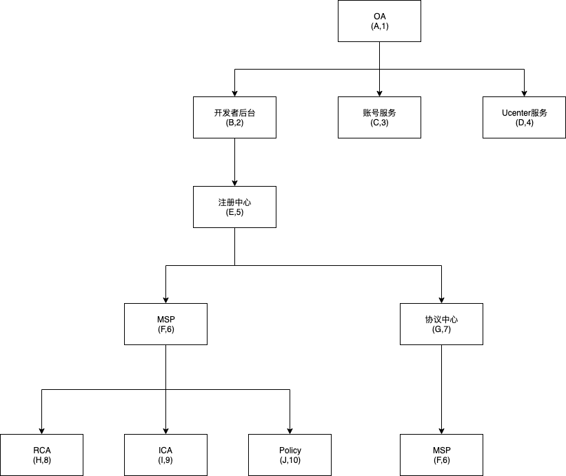
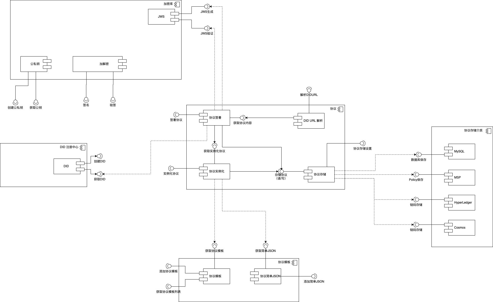

# 中台协议服务
## 服务拓扑关系图

## 用例图
@startuml
left to right direction
用户 --> (协议模板)
(协议模板) ..> (创建协议模板): <<include>>
(协议模板) ..> (获取协议模板列表): <<include>>
(协议模板) ..> (获取协议模板详情): <<include>>
(协议模板) ..> (更新协议模板): <<include>>
(协议模板) ..> (审核协议): <<include>>
(协议模板) ..> (发布协议到市场): <<include>>
用户 --> (协议实例化)
(协议实例化) ..> (实例化协议): <<include>>
(协议实例化) ..> (更新实例化协议): <<include>>
(协议实例化) ..> (获取实例化协议信息): <<include>>
用户 --> (协议签署)
(协议签署) ..> (签名实例化协议): <<include>>
(协议签署) ..> (解析DIDURL): <<include>>
用户 --> (DIDs)
(DIDs) ..> (创建DIDs): <<include>>
(DIDs) ..> (获取DIDs): <<include>>
用户 --> (公私钥)
(公私钥) ..> (创建公私钥对): <<include>>
(公私钥) ..> (获取私钥): <<include>>
(公私钥) ..> (获取公钥): <<include>>
用户 --> (协议设置)
(协议设置) ..> (协议存储设置): <<include>>
@enduml
## 类图

@startuml
Title "协议 - 合约 - DID"

  class "ProtocolTemlate(协议模板)"{
    Id
    Appkey
    Channel
    AccountId
    ProtocolTemplateId // 协议模板id
    State // 协议模板状态，1：审核，0 未审核
    Name // 协议模板名称
    ProtocolType // 协议类型
    DIDDocument:string //协议模板内容
    Version:string // 协议版本
    + public Add()  // 添加模板
    + public Verify() //审核模板
    + public Get() //获取模板列表
    + public Dell() // 删除模板
  }

  class "ProtocolInstance(协议实例)"{
    Id
    Appkey
    Channel
    AccountId
    ProtocolId  // 协议实例化id
    ProtocolTemplateId // 协议模板id
    Subject // 协议Subject DID
    Controller // 协议Controller DID
    SubjectProof //  协议Subject Proof
    ControllerProof // 协议Controller Proof
    DIDDocument // 协议文档
    IsSigned // 协议是否已签署
    IsPublish // 协议是否已发布
    Tx // 协议链上地址
    + public Instance()  // 实例化协议
    + public UpdateInstance() //更新实例化协议
    + public Signeture() //签署实例化协议
    + public ParserDIDUrl() // 协议didurl
  }

  class "ProtocolTemplateAnalysis(协议模板简单JSON)"{
    Id
    Appkey
    Channel
    AccountId
    ProtocolTemplateId // 协议模板id
    Property // 属性名称
    PropertyType // 属性类型
    AnalysisPath: //属性路径
    + public Add()  // 添加模板JSON字段
    + public Get() //获取模板JSON字段列表
    + public Dell() // 删除模板
    + public Update() // 更新模板JSON列表
  }

  class "DIDs(did)"{
    Id
    Appkey
    Channel
    RoleType // 类型：0 accountId，1 subOrgKey，2 appid
    SubjectId // 身份id 
    KeyType // 加密类型
    HashType // hash类型
    IdString //did string
    PublicKey // 公钥
    + public create()  // 创建did
    + public Get() //获取did
  }

  class "MSP" {}
  class "Hyperledger" {}
  

  "ProtocolTemlate(协议模板)" --* "ProtocolInstance(协议实例)"
  "ProtocolTemplateAnalysis(协议模板简单JSON)" --* "ProtocolInstance(协议实例)"
  "DIDs(did)" --* "ProtocolInstance(协议实例)"

  "ProtocolTemplateAnalysis(协议模板简单JSON)" .|> "ProtocolTemlate(协议模板)"

  "MSP" -down-* "ProtocolInstance(协议实例)"
  "Hyperledger" -down-* "ProtocolInstance(协议实例)"
@enduml

## 构件图

## 时序图

## 泳道图
### 生成公私钥对
@startuml
|生成公私钥|
start
:申请公私钥;
:验证参数合法性（appkey，channel，roleType, subjectId）;
|#AntiqueWhite|CA函数库|
:调用创建公私钥方法;
:存储公私钥对;
|生成公私钥|
:返回生成的公私钥信息;
stop
@enduml

### 生成DID
[生成DID生成过程](/didserver/DIDDesign.html#_5-1-create-did)
@startuml
|生成DID|
start
:验证参数合法性;
:根据生成DID生成过程生成DID 和 标准的DID Document;
@enduml

### 添加协议模板
@startuml
|协议模板|
start
:验证参数合法性;
:添加协议;
stop
@enduml

### 添加协议模板属性
@startuml
|协议模板|
start
:验证参数合法性;
:验证协议模板id是否合法;
:判断属性是否合法;
:添加属性;
:返回添加结果;
stop
@enduml

### 获取协议模板属性列表
@startuml
|协议模板|
start
:验证参数合法性;
:验证协议模板id是否合法;
:获取协议模板对应的属性列表;
:返回结果;
stop
@enduml

### 更新协议模板
@startuml
|协议模板|
start
:验证参数合法性;
:更新协议内容;
:更新协议版本;
stop
@enduml

### 获取协议模板详情
@startuml
|协议模板|
start
:验证参数合法性;
:获取协议详情;
:返回协议数据;
stop
@enduml

### 获取协议模板列表
@startuml
|协议模板|
start
:验证参数合法性;
:根据筛选条件获取协议模板列表;
:返回协议列表数据;
stop
@enduml

### 发布协议模板
@startuml
|协议模板|
start
:验证参数合法性;
|#AntiqueWhite|市场接口|
:发布到市场;
:获取市场返回结果;
|协议模板|
:更新发布结果;
stop
@enduml

### 获取协议属性
@startuml
|协议属性|
start
:验证参数合法性;
:获取协议属性;
:返回协议属性数据;
stop
@enduml

### 实例化协议

@startuml
|协议属性|
start
:验证参数合法性;
if (判断属性是否被实例化) then (yes)
  :实例化当前属性对应的内容;
else (nothing)
  :返回 error;
stop
@enduml

### jws签名
@startuml
|协议属性|
start
:验证参数合法性;
:生成签名;
stop
@enduml

### jws验证签名
@startuml
|协议属性|
start
:验证参数合法性;
:验证签名;
stop
@enduml

### 签署协议
@startuml
|协议属性|
start
:验证参数合法性;
:验证签署主体信息是否正确;
:验证协议实例化是否正确;
:验证签名信息是否正确;
:签署协议，返回didurl;
stop
@enduml

### 根据DIDURL解析签署协议
@startuml
|协议属性|
start
:验证参数合法性;
:解析DIDURL;
:根据DIDurl的fragment，根据内容，query来查询具体的数据;
:返回对应的数据;
stop
@enduml

## 其他要求
### 1. did url解析
1. 根据[did设计规范](/didserver/#did-string-format) 解析每个标识符
### 2. did document解析
2. 根据[标准的did document](/didserver/#did-document) 解析did document