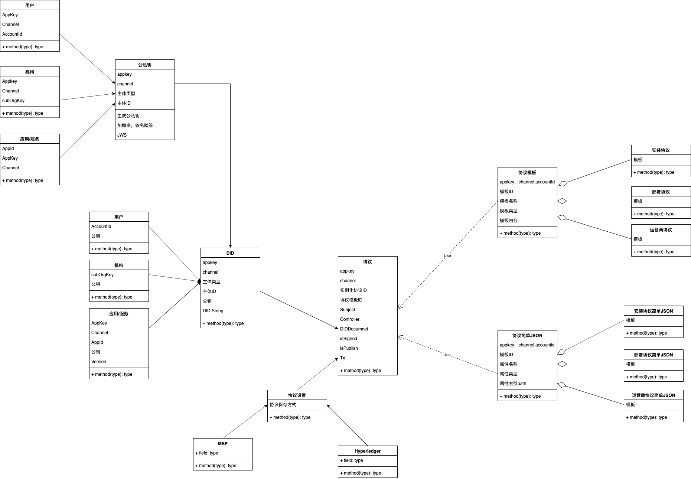

# 中台协议服务
## 服务拓扑关系图

## 用例图
@startuml
left to right direction
用户 --> (协议模板)
(协议模板) ..> (创建协议模板): <<include>>
(协议模板) ..> (获取协议模板列表): <<include>>
(协议模板) ..> (获取协议模板详情): <<include>>
(协议模板) ..> (更新协议模板): <<include>>
(协议模板) ..> (审核协议): <<include>>
(协议模板) ..> (发布协议到市场): <<include>>
用户 --> (协议实例化)
(协议实例化) ..> (实例化协议): <<include>>
(协议实例化) ..> (更新实例化协议): <<include>>
(协议实例化) ..> (获取实例化协议信息): <<include>>
用户 --> (协议签署)
(协议签署) ..> (签名实例化协议): <<include>>
(协议签署) ..> (解析DIDURL): <<include>>
用户 --> (DIDs)
(DIDs) ..> (创建DIDs): <<include>>
(DIDs) ..> (获取DIDs): <<include>>
用户 --> (公私钥)
(公私钥) ..> (创建公私钥对): <<include>>
(公私钥) ..> (获取私钥): <<include>>
(公私钥) ..> (获取公钥): <<include>>
用户 --> (协议设置)
(协议设置) ..> (协议存储设置): <<include>>
@enduml
## 类图

## 构件图

## 时序图

## 泳道图
### 生成公私钥对
@startuml
|生成公私钥|
start
:申请公私钥;
:验证参数合法性（appkey，channel，roleType, subjectId）;
|#AntiqueWhite|CA函数库|
:调用创建公私钥方法;
:存储公私钥对;
|生成公私钥|
:返回生成的公私钥信息;
stop
@enduml

### 生成DID
[生成DID生成过程](/didserver/DIDDesign.html#_5-1-create-did)
@startuml
|生成DID|
start
:验证参数合法性;
:根据生成DID生成过程生成DID 和 标准的DID Document;
@enduml

### 添加协议模板
@startuml
|协议模板|
start
:验证参数合法性;
:添加协议;
stop
@enduml

### 添加协议模板属性
@startuml
|协议模板|
start
:验证参数合法性;
:验证协议模板id是否合法;
:判断属性是否合法;
:添加属性;
:返回添加结果;
stop
@enduml

### 获取协议模板属性列表
@startuml
|协议模板|
start
:验证参数合法性;
:验证协议模板id是否合法;
:获取协议模板对应的属性列表;
:返回结果;
stop
@enduml

### 更新协议模板
@startuml
|协议模板|
start
:验证参数合法性;
:更新协议内容;
:更新协议版本;
stop
@enduml

### 获取协议模板详情
@startuml
|协议模板|
start
:验证参数合法性;
:获取协议详情;
:返回协议数据;
stop
@enduml

### 获取协议模板列表
@startuml
|协议模板|
start
:验证参数合法性;
:根据筛选条件获取协议模板列表;
:返回协议列表数据;
stop
@enduml

### 发布协议模板
@startuml
|协议模板|
start
:验证参数合法性;
|#AntiqueWhite|市场接口|
:发布到市场;
:获取市场返回结果;
|协议模板|
:更新发布结果;
stop
@enduml

### 获取协议属性
@startuml
|协议属性|
start
:验证参数合法性;
:获取协议属性;
:返回协议属性数据;
stop
@enduml

### 实例化协议

@startuml
|协议属性|
start
:验证参数合法性;
if (判断属性是否被实例化) then (yes)
  :实例化当前属性对应的内容;
else (nothing)
  :返回 error;
stop
@enduml

### jws签名
@startuml
|协议属性|
start
:验证参数合法性;
:生成签名;
stop
@enduml

### jws验证签名
@startuml
|协议属性|
start
:验证参数合法性;
:验证签名;
stop
@enduml

### 签署协议
@startuml
|协议属性|
start
:验证参数合法性;
:验证签署主体信息是否正确;
:验证协议实例化是否正确;
:验证签名信息是否正确;
:签署协议，返回didurl;
stop
@enduml

### 根据DIDURL解析签署协议
@startuml
|协议属性|
start
:验证参数合法性;
:解析DIDURL;
:根据DIDurl的fragment，根据内容，query来查询具体的数据;
:返回对应的数据;
stop
@enduml

## 其他要求
### 1. did url解析
1. 根据[did设计规范](/didserver/#did-string-format) 解析每个标识符
### 2. did document解析
2. 根据[标准的did document](/didserver/#did-document) 解析did document