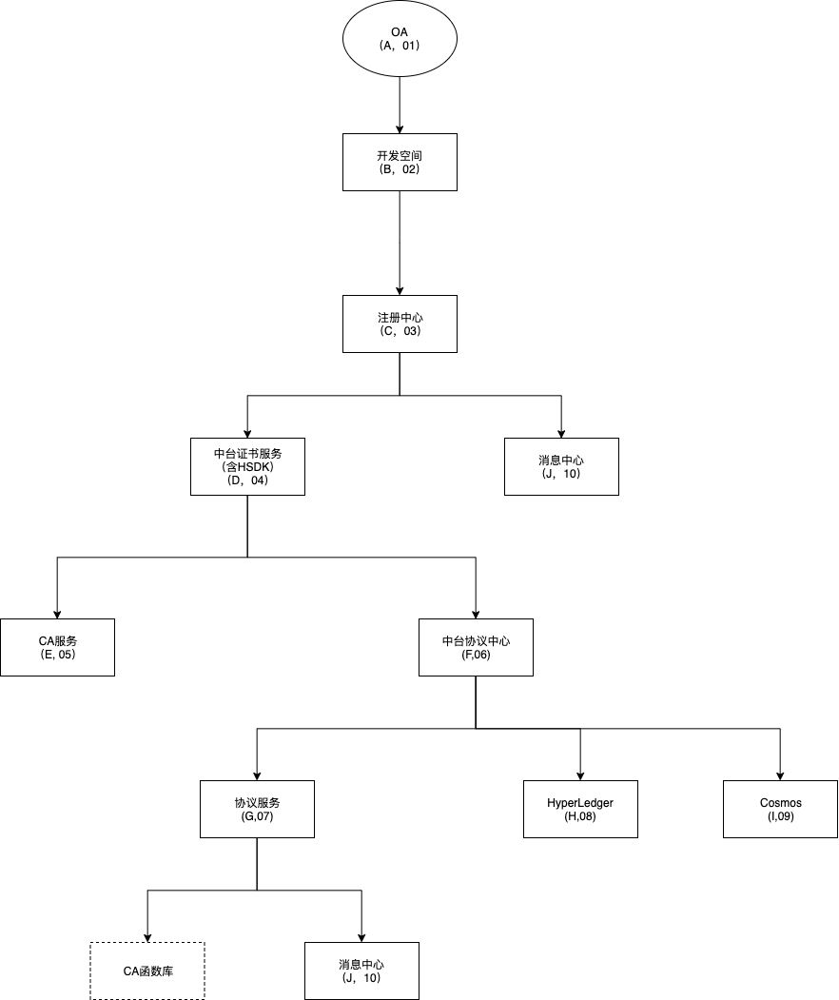

# 中台协议服务
## 服务拓扑关系图

## 用例图
@startuml
left to right direction
用户 --> (协议模板)
(协议模板) ..> (创建协议模板): <<include>>
(协议模板) ..> (获取协议模板列表): <<include>>
(协议模板) ..> (获取协议模板详情): <<include>>
(协议模板) ..> (更新协议模板): <<include>>
(协议模板) ..> (审核协议): <<include>>
(协议模板) ..> (发布协议到市场): <<include>>
用户 --> (协议实例化)
(协议实例化) ..> (实例化协议): <<include>>
(协议实例化) ..> (更新实例化协议): <<include>>
(协议实例化) ..> (获取实例化协议信息): <<include>>
用户 --> (协议签署)
(协议签署) ..> (签名实例化协议): <<include>>
(协议签署) ..> (解析DIDURL): <<include>>
用户 --> (DIDs)
(DIDs) ..> (创建DIDs): <<include>>
(DIDs) ..> (获取DIDs): <<include>>
用户 --> (公私钥)
(公私钥) ..> (创建公私钥对): <<include>>
(公私钥) ..> (获取私钥): <<include>>
(公私钥) ..> (获取公钥): <<include>>
用户 --> (协议设置)
(协议设置) ..> (协议存储设置): <<include>>
@enduml

### 生成DID
#### 选择DID type

选择`RoleType`,`KeyType`,`HashType`,DID是 DID string的二进制格式的前两位bytes DID Type 由如下三部分组成：

1. RoleType：前6位bits

> 后期按需扩展

- accountId = 0
- subOrgKey = 1
- appid = 2
- appkey = 3
- apppkey_version = 4
...
- any = 63

1. KeyType：中间5位bits

> 用于指定secret key 转换 public key 的 算法

- ED25519 = 0
- SECP256K1 = 1
- EcdsaP256 = 2


1. Hash：最5位bits

> 用于计算公钥哈希的Hash函数

- keccak = 0
- sha3 = 1
- keccak_384 = 2
- sha3_384 = 3
- keccak_512 = 4
- sha3_512 = 5

例如：DID Type ：`0x0C01`  可以做如下解析

```
+-------------+-----------+------------+
| 000011      | 00000     | 00001      |
+-------------+-----------+------------+
| application | ed25519   | sha3       |
+-------------+-----------+------------+

```


#### 获得public key

使用KeyType对应的方式来讲secret key 转换为 publick key。

例如：`E4852B7091317E3622068E62A5127D1FB0D4AE2FC50213295E10652D2F0ABFC7`

#### 获取public key 的Hash

`EC8E681514753FE5955D3E8B57DAEC9D123E3DB146BDDFC3787163F77F057C27`

#### 获取public key hash 的前20 bytes

`EC8E681514753FE5955D3E8B57DAEC9D123E3DB1`

#### 在5中获得hash前添加DID Type：`0x0C01`

`0C01EC8E681514753FE5955D3E8B57DAEC9D123E3DB1`

#### 获取6中hash的扩展hash

`42CD815145538F8003586C880AF94418341F9C4B8FA0394876553F8A952C7D03`

#### 取7中前4个bytes

`42CD8151`

#### 生成二进制的 DID String

将8得到的4个bytes放到6中得到hash的后边。得到DID String的二进制格式
`0C01EC8E681514753FE5955D3E8B57DAEC9D123E3DB142CD8151`

#### 加密二进制的DID String

使用 Base58 方法进行二进制的文件编码。完成之后再起前边添加`idg`  得到DID String
`idgNKtCNqYWLYWYW3gWRA1vnRykfCBZYHZvzKr`

#### 完整的DID如下

`did:idg:idgNKtCNqYWLYWYW3gWRA1vnRykfCBZYHZvzKr`

::: tip
``` go
func GenerateDID(methods string, publicKey string, roleType int64, keyType int64, hashType int64) (*DIDInfo, error) {

	pk := []byte(publicKey)
	// hash the public key
	publicKeyHash := hashPublicKey(pk, hashType)
	publicKeyHashStr := hex.EncodeToString(publicKeyHash[:])
	fmt.Printf("%64s - %6s - sha3-256 hash of public key\n", publicKeyHashStr, "Public Key Hash String")

	// truncate the hash to the first 20 bytes
	publicKeyHash20 := publicKeyHash[0:20]
	publicKeyHash20Str := hex.EncodeToString(publicKeyHash20)
	fmt.Printf("%64s - %6s - sha3-256 hash of public key first 20 bytes\n", publicKeyHash20Str, "Public Key Hash String(20)")

	// Add the DID type bytes did type in front of the hash
	publicKeyHashDIDType := append(GenerateDIDType(roleType, keyType, hashType), publicKeyHash20...)
	publicKeyHashDIDTypeStr := hex.EncodeToString(publicKeyHashDIDType)
	fmt.Printf("%64s - %6s - Add the DID type bytes in front of the hash\n", publicKeyHashDIDTypeStr, "Public Key Hash With DID Type")

	// Get the hash of the extended hash
	publicKeyHash2 := hashPublicKey(publicKeyHashDIDType, hashType)
	publicKeyHash2Str := hex.EncodeToString(publicKeyHash2[:])
	fmt.Printf("%64s - %6s - sha3-256 extended hash of hash\n", publicKeyHash2Str, "Public Key Hash2 String")

	// Take the first 4 bytes of publicKeyHash2
	publicKeyHash24 := publicKeyHash2[0:4]
	publicKeyHash24Str := hex.EncodeToString(publicKeyHash24)
	fmt.Printf("%64s - %6s - sha3-256 extended hash of hash first 4 bytes\n", publicKeyHash24Str, "Public Key Hash2-4 String")

	// get DIDByteString
	DIDByte := append(publicKeyHashDIDType, publicKeyHash24...)
	DIDByteStr := hex.EncodeToString(DIDByte)
	fmt.Printf("%64s - %6s - generated DID String\n", DIDByteStr, "DID Binary String")

	// base58 encode DIDByteString
	didBase58 := "ch" + base58.Encode(DIDByte)
	fmt.Printf("%64s - %6s - Encode base58\n", didBase58, "DID String (base58)")

	// make the DID
	didstring := &did.DID{
		Method: methods,
		ID:     didBase58,
	}
	fmt.Println("DIDstring:", methods, didBase58, didstring.DIDToString())

	authData := diddocument.Authentication{
		Id:              didstring.DIDToString(),
		Type:            "Ed25519VerificationKey2018",
		Controller:      didstring.DIDToString(),
		PublicKeyBase58: publicKey,
	}

	AuthenticationData := []diddocument.Authentication{}

	AuthenticationData = append(AuthenticationData, authData)

	// make did doc
	didDoc := &diddocument.DIDDocument{
		Id:             didstring.DIDToString(),
		Authentication: AuthenticationData,
	}

	didDoc.DocumentCreator()

	didDocs, err := didDoc.DocToString()

	if err != nil {
		return nil, err
	}

	didData := &DIDInfo{
		IdString: didstring.DIDToString(),
		Document: didDocs,
	}

	fmt.Println("didData:", didData)
	return didData, nil
}
```
:::
## 类图

@startuml
Title "协议 - 合约 - DID"

  class "ProtocolTemlate(协议模板)"{
    Id
    Appkey
    Channel
    AccountId
    ProtocolTemplateId // 协议模板id
    State // 协议模板状态，1：审核，0 未审核
    Name // 协议模板名称
    ProtocolType // 协议类型
    DIDDocument:string //协议模板内容
    Version:string // 协议版本
    + public Add()  // 添加模板
    + public Verify() //审核模板
    + public Get() //获取模板列表
    + public Dell() // 删除模板
  }

  class "ProtocolInstance(协议实例)"{
    Id
    Appkey
    Channel
    AccountId
    ProtocolId  // 协议实例化id
    ProtocolTemplateId // 协议模板id
    Subject // 协议Subject DID
    Controller // 协议Controller DID
    SubjectProof //  协议Subject Proof
    ControllerProof // 协议Controller Proof
    DIDDocument // 协议文档
    IsSigned // 协议是否已签署
    IsPublish // 协议是否已发布
    Tx // 协议链上地址
    + public Instance()  // 实例化协议
    + public UpdateInstance() //更新实例化协议
    + public Signeture() //签署实例化协议
    + public ParserDIDUrl() // 协议didurl
  }

  class "ProtocolTemplateAnalysis(协议模板简单JSON)"{
    Id
    Appkey
    Channel
    AccountId
    ProtocolTemplateId // 协议模板id
    Property // 属性名称
    PropertyType // 属性类型
    AnalysisPath: //属性路径
    + public Add()  // 添加模板JSON字段
    + public Get() //获取模板JSON字段列表
    + public Dell() // 删除模板
    + public Update() // 更新模板JSON列表
  }

  class "DIDs(did)"{
    Id
    Appkey
    Channel
    RoleType // 类型：0 accountId，1 subOrgKey，2 appid
    SubjectId // 身份id 
    KeyType // 加密类型
    HashType // hash类型
    IdString //did string
    PublicKey // 公钥
    + public create()  // 创建did
    + public Get() //获取did
  }

  class "MSP" {}
  class "Hyperledger" {}
  

  "ProtocolTemlate(协议模板)" --* "ProtocolInstance(协议实例)"
  "ProtocolTemplateAnalysis(协议模板简单JSON)" --* "ProtocolInstance(协议实例)"
  "DIDs(did)" --* "ProtocolInstance(协议实例)"

  "ProtocolTemplateAnalysis(协议模板简单JSON)" .|> "ProtocolTemlate(协议模板)"

  "MSP" -down-* "ProtocolInstance(协议实例)"
  "Hyperledger" -down-* "ProtocolInstance(协议实例)"
@enduml

## 构件图


## 时序图


